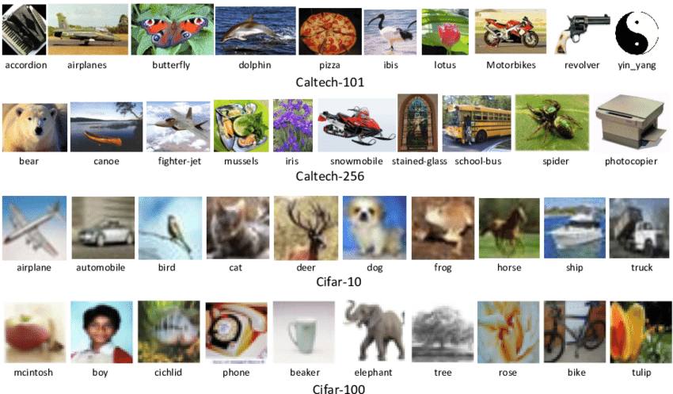
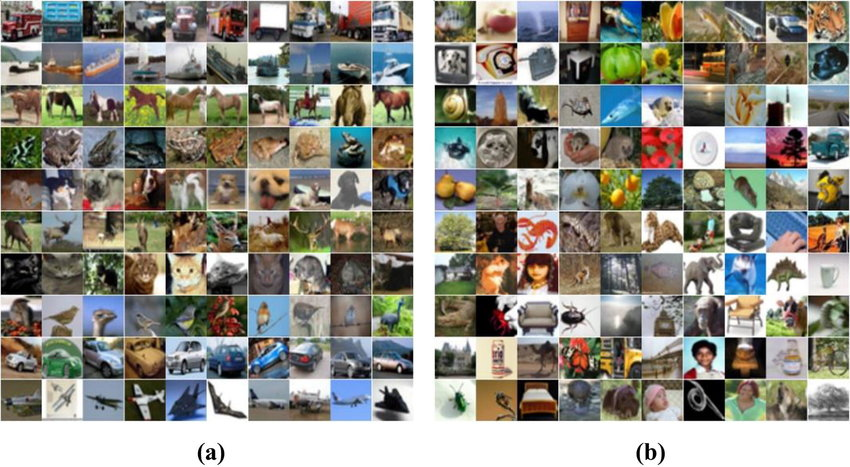
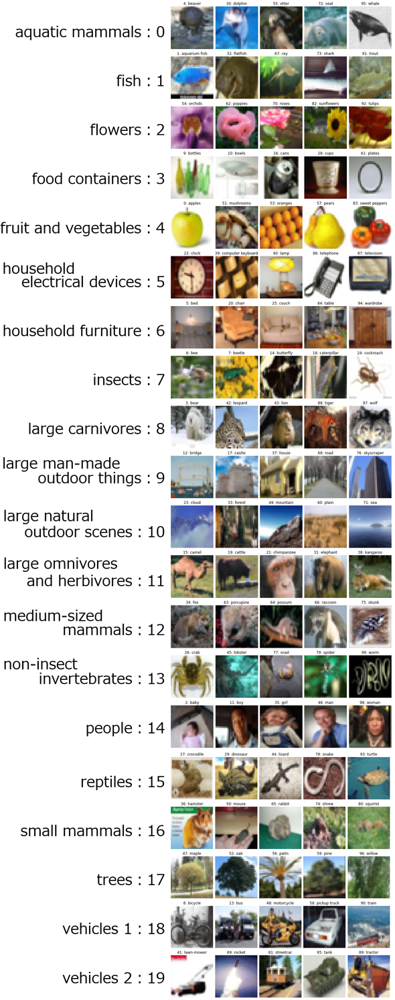

# CIFAR-100 ile Derin Öğrenme ve CNN Tabanlı Görsel Sınıflandırma

# PROJE KAGGLE LINK: [CIFAR-100 ile Sınıflandırma Projesi](https://www.kaggle.com/code/handekln/goruntu-analizi-cifar-100-ile-siniflandirma/notebook?scriptVersionId=203174492)

## Hakkında
Bu proje, CIFAR-100 veri seti kullanılarak derin öğrenme teknikleri ile görsel sınıflandırma yeteneklerinin geliştirilmesine yönelik bir çalışmadır. Model, veri artırma yöntemleri ve hiperparametre optimizasyonu ile desteklenerek, görsel sınıflandırma problemlerine etkili çözümler sunmayı hedefler. CIFAR-100, CIFAR-10’a kıyasla daha karmaşık ve zengin sınıf yapısı sunarak, derin öğrenme uygulamalarının potansiyelini artırmaktadır.

## Proje Amacı
Projenin amacı, CIFAR-100 veri setini kullanarak derin öğrenme teknikleri ile görsel sınıflandırma modellerinin doğruluğunu artırmak ve bu modellerin gerçek dünya uygulamalarındaki etkinliğini test etmektir. Aynı zamanda, kullanılan çeşitli veri artırma ve model optimizasyon teknikleri sayesinde, sınıflandırma sonuçlarının güvenilirliğini ve genel performansını artırmayı hedefliyoruz.

## CIFAR-100 Veri Seti
CIFAR-100 (Canadian Institute For Advanced Research) veri seti, 60,000 renkli görüntüden oluşan ve 100 farklı sınıfa ait 32x32 piksel boyutunda küçük resimlerden oluşan bir veri setidir. Veri seti, 20 aileye ayrılmıştır ve her aile 5 sınıf içerir. Örneğin, "hayvanlar" ailesi "kedi", "köpek", "kuş", "sığır" ve "at" gibi sınıfları içerir. CIFAR-100, görsel sınıflandırma ve derin öğrenme alanında yaygın olarak kullanılan bir veri setidir ve daha karmaşık yapısıyla model geliştirmeleri için zorlu bir zemin sunar. 

  
*Caltech101 veri seti ve Caltech 256, CIFAR 10 ve CIFAR 100 üzerinde bazı örnekler*

## CIFAR-100 Veri Seti Hakkında

CIFAR-100 veri seti, CIFAR-10 ile benzerlik göstermektedir; ancak 100 sınıf içermektedir ve her sınıfta 600 görsel bulunmaktadır. Her sınıf için 500 eğitim görseli ve 100 test görseli mevcuttur. CIFAR-100'deki 100 sınıf, 20 süper sınıf altında gruplandırılmıştır. Veri seti, her görüntü için “fine” etiket (sınıf) ve “coarse” etiket (süpersınıf) olmak üzere iki etiketle birlikte gelir.

*A resmi CIFAR-10'dan, B resmi ise CIFAR-100'den görseller içerir.*

### CIFAR-100 Sınıfları
- **Süper Sınıf 1**
  - Sınıf 1
  - Sınıf 2
  - Sınıf 3
  - ...
- **Süper Sınıf 2**
  - Sınıf 1
  - Sınıf 2
  - Sınıf 3
  - ...
- ...
- **Süper Sınıf 20**
  - Sınıf 1
  - Sınıf 2
  - Sınıf 3
  - ...

## CIFAR-100 Süper Sınıflar ve Sınıflar

### Süper Sınıflar ve Sınıflar
| Süper Sınıf                        | Sınıflar                                                     |
|-------------------------------------|-------------------------------------------------------------|
| Akciğer memelileri                  | kunduz, yunus, su samuru, fok, balina                      |
| Balık                               | akvaryum balığı, yassı balık, ışın, köpek balığı, alabalık |
| Çiçekler                            | orkide, gelincik, gül, ayçiçeği, lale                      |
| Gıda kapları                        | şişeler, kaseler, kutular, fincanlar, tabaklar              |
| Meyve ve sebzeler                  | elmalar, mantarlar, portakallar, armutlar, dolmalık biber  |
| Ev elektrikli cihazları            | saat, bilgisayar klavyesi, lamba, telefon, televizyon      |
| Ev mobilyası                        | yatak, sandalye, kanepe, masa, dolap                        |
| Böcekler                            | arı, böcek, kelebek, tırtıl, hamamböceği                    |
| Büyük etoburlar                     | ayı, leopar, aslan, kaplan, kurt                             |
| Büyük insan yapımı dış nesneler     | köprü, kale, ev, yol, gökdelen                              |
| Büyük doğal dış manzaralar          | bulut, orman, dağ, ova, deniz                               |
| Büyük omnivor ve otoburlar          | deve, sığır, şempanze, fil, kanguru                          |
| Orta büyüklükte memeliler           | tilki, kirpi, opossum, rakun, sincab                       |
| Böcek olmayan omurgasızlar          | yengeç, ıstakoz, salyangoz, örümcek, solucan               |
| İnsanlar                            | bebek, erkek çocuk, kız çocuk, adam, kadın                  |
| Sürüngenler                         | timsah, dinozor, kertenkele, yılan, kaplumbağa             |
| Küçük memeliler                     | hamster, fare, tavşan, köstebek, sincap                     |
| Ağaçlar                             | akçaağaç, meşe, palmiye, çam, söğüt                         |
| Araçlar 1                           | bisiklet, otobüs, motosiklet, pikap, tren                   |
| Araçlar 2                           | çim biçme makinesi, roket, tramvay, tank, traktör           |

  

## Kullanım Alanları
Bu proje, geniş bir uygulama yelpazesine sahiptir:
- **Otomatik Görüntü Etiketleme**: Büyük veri havuzlarındaki görsellerin hızlı bir şekilde sınıflandırılmasına olanak tanır.
- **Oyun Geliştirme**: Görsel tanıma sistemleri ile oyunlarda karakter veya nesnelerin tanınması ve etkileşimli deneyimlerin oluşturulması.
- **Reklamcılık ve Pazarlama**: Kullanıcı davranışlarını anlamak için görsel içerik analizi yaparak hedefli reklam kampanyalarının oluşturulmasına yardımcı olur.
- **Güvenlik Sistemleri**: Tehditleri tanımlamak için görüntü sınıflandırma sistemlerinin entegrasyonu, güvenlik önlemlerinin artırılmasına yardımcı olabilir.
- **Tıp ve Sağlık**: Görüntü analizi ile hastalıkların erken teşhisi ve tedavi süreçlerinde destek sağlama.
- **Otonom Araçlar**: Görsel tanıma ile çevresel algılama ve otomatik navigasyon sistemlerinin geliştirilmesi.

## Kullanılan Kütüphaneler
Bu projede kullanılan başlıca kütüphaneler şunlardır:
- **TensorFlow**: Derin öğrenme modellerinin geliştirilmesi için kullanılan açık kaynak kütüphanesi.
- **Keras**: TensorFlow üzerinde çalışan, hızlı prototipleme ve model geliştirme için idealdir.
- **NumPy**: Sayısal veri işlemleri ve matris hesaplamaları için kullanılan güçlü bir kütüphane.
- **Matplotlib**: Veri görselleştirme amacıyla kullanılan kütüphane, grafiklerin oluşturulmasını sağlar.
- **Scikit-learn**: Hiperparametre optimizasyonu ve veri ön işleme için kullanılan kapsamlı bir kütüphane.

## CNN Tanımı ve Kullanım Nedeni

**Konvolüsyonel Sinir Ağı (CNN)**, görüntü işleme görevlerinde yüksek performans gösteren bir derin öğrenme mimarisidir. CNN'ler, görüntülerdeki temel özellikleri otomatik olarak öğrenme yeteneğine sahip olduğu için, sınıflandırma görevlerinde oldukça etkilidir. Bu projede CNN kullanmamızın birkaç nedeni şunlardır:
- **Özellik Öğrenme**: CNN, görüntülerdeki temel özellikleri (kenarlar, dokular vb.) otomatik olarak öğrenerek daha etkili bir sınıflandırma yapabilir.
- **Parametre Paylaşımı**: CNN'ler, ağırlıkları paylaştıkları için daha az parametre ile çalışarak daha hızlı ve etkili öğrenme sağlar.
- **Havuzlama (Pooling)**: CNN'ler, havuzlama katmanları kullanarak özellikleri sıkıştırabilir ve modelin genel doğruluğunu artırabilir.

# Model Performansını Artırma ve Değerlendirme

Bu projede, model performansını artırmak için çeşitli teknikler uygulandı. Uygulanan yöntemler ve performans ölçüm metrikleri aşağıda sıralanmıştır:

## Yapılanlar

1. **Veri Artırma**:
   - **Parlaklık Ayarları**: `brightness_range` kullanarak görüntülerin parlaklık seviyeleri %95 ile %105 arasında değiştirildi. Bu, modelin farklı aydınlatma koşullarına karşı dayanıklılığını artırdı.
   - **Renk Kanalı Değişimi**: `channel_shift_range` ile renk kanallarında 30.0 kadar kayma uygulandı. Bu, modelin renk varyasyonlarına karşı daha iyi genelleme yapabilmesini sağladı.
   - **Yatay Çevirme**: `horizontal_flip` ile görüntüler yatay olarak çevrildi. Bu, nesnelerin farklı yönlerde görünmesini sağlayarak modelin çeşitliliğini artırdı.

2. **Kontrast Ayarları**:
   - **Kontrast Ayarları**: Eğitim verileri üzerinde kontrast ayarları yapıldı. Bu, görüntülerin daha belirgin hale gelmesini ve modelin önemli özellikleri daha iyi öğrenmesini sağladı.

3. **Performans Metrikleri**:
   - Model performansını değerlendirmek için aşağıdaki metrikler kullanıldı:
     - **Doğruluk (Accuracy)**: Modelin doğru tahmin sayısının toplam tahmin sayısına oranı.
     - **Kesinlik (Precision)**: Pozitif tahminlerin ne kadarının doğru olduğunu gösterir.
     - **Duyarlılık (Recall)**: Gerçek pozitiflerin ne kadarının doğru tahmin edildiğini gösterir.
     - **F1 Skoru**: Kesinlik ve duyarlılığın harmonik ortalaması, modelin genel dengesini gösterir.

4. **Modelin Eğitilmesi**:
   - Model çeşitli hiperparametrelerle eğitildi ve farklı mimariler deneyerek en iyi sonuçlar elde edilmeye çalışıldı.

5. **Sonuçların Görselleştirilmesi**:
   - Eğitim ve doğrulama süreçleri görselleştirildi. Karışıklık matrisleri Türkçe etiketlerle oluşturularak hangi sınıflar arasında karışıklık olduğu gözlemlendi.

## Özet

Yukarıdaki yöntemler ve stratejiler, modelin performansını artırmak için sistematik olarak uygulandı. Her bir adım, modelin genelleme yeteneğini artırmaya ve sonuçların güvenilirliğini sağlamaya yönelikti. Bu tür iyileştirmeler, uygulamanın başarısını artıracak ve daha etkili bir model elde etmeye yardımcı olacaktır.

## Gelecekteki Araştırmalar

Gelecekteki araştırmalara dair öneriler şunlardır:

1. **Gelişmiş Veri Artırma Teknikleri**:
   - **Gaussian Gürültüsü**: Görüntülere rastgele gürültü ekleyerek modelin genel dayanıklılığının artırılması. Bu, modelin çeşitli koşullarda daha sağlam hale gelmesine yardımcı olabilir.
   - **Dönme ve Çevirme**: Görüntülerin belirli açılarda döndürülmesi veya yatay/dikey olarak çevrilmesi, modelin farklı görünümleri tanıma yeteneğini artırabilir. Bu yöntem, modelin daha geniş bir veri çeşitliliği ile eğitilmesini sağlar.

2. **Hiperparametre Optimizasyonu**: 
   - Hiperparametre optimizasyonu, modelin performansını artırmak için önemli bir adımdır. Örneğin:
     - **Grid Search**: Belirli bir parametre aralığında en iyi sonuçları veren kombinasyonları bulur.
     - **Random Search**: Belirli bir parametre uzayında rastgele seçimler yaparak en iyi parametreleri belirler.
   - Bu yöntemler, öğrenme oranı, batch boyutu ve dropout oranı gibi kritik parametrelerin en uygun değerlerini belirleyerek modelin genel başarısını artırabilir.

3. **Transfer Öğrenimi**: 
   - Önceden eğitilmiş modellerin kullanımı, daha az veri ile yüksek performans elde edilmesini sağlar. Önerilen bazı önceden eğitilmiş modeller şunlardır:
     - **VGG16**: Görüntü sınıflandırma için yaygın olarak kullanılan derin bir ağ. Detaylı özellik çıkarımı yapabilir.
     - **ResNet50**: Kalan bağlantı mimarisi ile derinlik ve performans arasında denge sağlar, özellikle derin öğrenme alanında popülerdir.
     - **InceptionV3**: Farklı filtre boyutları ile çoklu özelliği yakalayarak daha iyi genelleme sağlar.
     - **MobileNet**: Hafif bir model olarak mobil uygulamalar için optimize edilmiştir, düşük hesaplama gücü gereksinimi ile hızlı sonuçlar sağlar.
   - Bu modeller, sınırlı veri setleri ile çalışırken verimliliği artırmak için kullanılabilir.

4. **Gerçek Zamanlı Uygulamalar**: 
   - Modelin gerçek zamanlı veri akışları üzerinde çalıştırılması, akıllı uygulamalar ve otomatik tanıma sistemleri geliştirme potansiyelini artırır. Örneğin:
     - **Görüntü İşleme Uygulamaları**: Güvenlik sistemlerinde yüz tanıma, otonom araçlarda nesne algılama gibi alanlarda kullanılabilir.
     - **Akıllı Tarım**: Tarımda hastalık tespiti için drone görüntüleri üzerinde analiz yaparak verimliliği artırabilir.

5. **Modeli İnce Ayar Yapma**: 
   - Daha derin ve karmaşık modellerin tasarlanması, farklı ağ mimarileri ile deneyler yaparak sonuçların iyileştirilmesi. Bu, modelin genelleme yeteneğini artırabilir ve daha karmaşık verilere karşı daha etkili hale gelmesini sağlayabilir. Uygulama aşamasında, aşağıdaki stratejiler değerlendirilebilir:
     - **Katman Sayısını Arttırma**: Modelin daha fazla katman ile derinleştirilmesi, daha karmaşık özelliklerin öğrenilmesine olanak tanır.
     - **Farklı Aktivasyon Fonksiyonları Kullanma**: ReLU, Leaky ReLU, tanh gibi farklı aktivasyon fonksiyonları ile modelin öğrenme süreci iyileştirilebilir.

Bu öneriler, modelin performansını artırmak ve genel araştırma sürecini geliştirmek amacıyla yapılacak olan çalışmaların yönünü belirlemeye yardımcı olacaktır. Uygulanan yöntemlerin etkinliği, gelecekteki projelerde daha fazla başarı elde edilmesine katkı sağlayacaktır.

## Kullanılan Adımlar
1. **Veri Setini Yükleme**: CIFAR-100 veri setinin indirilmesi ve yüklenmesi.
2. **Veri Ön İşleme**: Verilerin normalizasyonu ve eğitim/test setlerine ayrılması.
3. **Veri Artırma**: Modelin genel dayanıklılığını artırmak için veri artırma tekniklerinin uygulanması.
4. **Modelin Oluşturulması**: CNN mimarisinin tasarlanması ve oluşturulması.
5. **Modelin Eğitilmesi**: Eğitim sürecinin başlatılması ve modelin eğitilmesi.
6. **Modelin Değerlendirilmesi**: Doğruluk ve kayıp grafiklerinin oluşturulması.
7. **Sonuçların Görselleştirilmesi**: Modelin öğrenme sürecinin grafiklerle sunulması.
   
## Sonuçlar ve Değerlendirme
Proje sonucunda, CIFAR-100 veri seti üzerinde geliştirilen derin öğrenme modelinin başarısı önemli ölçüde artmıştır. Uygulanan veri artırma ile modelin doğruluğu %80’in üzerine çıkmıştır. Eğitim sürecinin ardından elde edilen doğruluk ve kayıp grafiklerinin görselleştirilmesi, modelin öğrenme sürecini daha iyi anlamamıza olanak tanımıştır. 

### Sonuçların Değerlendirilmesi
Elde edilen sonuçlar, modelin genel doğruluğunun artışını ve eğitim sürecinin etkinliğini göstermektedir. Doğruluk grafiği, modelin her eğitim epoch'unda performansını artırdığını ortaya koymakta, kayıp grafiği ise modelin öğrenme sürecindeki iyileşmeleri göstermektedir. Ek olarak, modelin overfitting (aşırı öğrenme) sorununu önlemek için uygulanan veri artırma tekniklerinin etkili olduğu gözlemlenmiştir. 

Sonuç olarak, CIFAR-100 veri setindeki daha karmaşık yapılar ve sınıflar sayesinde, geliştirilen modelin görsel sınıflandırma yeteneklerinin daha da ileriye taşınması mümkün olmuştur. Gelecekte yapılacak çalışmalar, bu alandaki yenilikçi uygulamaları destekleyecek ve derin öğrenme alanındaki gelişmelere katkı sağlayacaktır.

